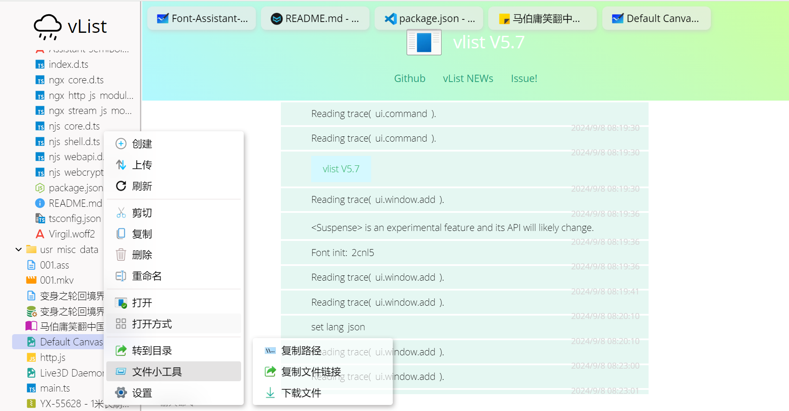

# vlist5
<span style="color: gray">性能与全能的平衡</span>

全能还好看的文件管理方案<br>
使用Vue构建，与NJS集成<br>
支持超多打开方式，很多好用的小工具



## 为什么是vList
vList最初就是为了Nginx设计的，经历了4代的积淀已经拥有成熟的方案了<br>
为了并发考虑，我们将大部分功能放在了前端，且对于验证机制使用了SHA1-HMAC，安全可靠<br>
在操作逻辑上，我们向Windows靠拢，右键菜单、Shift多选、拖拽、Explorer...简单易用

## 项目起源
本来Github上有很多类似的项目了，有的甚至做的比我好，如KodBox<br>
但是本人最近开始返璞归真，想要**在最简单的环境下(光猫)部署网盘服务**<br>
这个环节无法部署Sql服务，装不下Web套装(Nginx+PHP)，这时我就在想创建一个vList项目<br>
**vList基于Nginx的功能，100%原生支持**，但是随着功能越来越多fancyIndex已经满足不了需求<br>
于是vList升级到了v5

## 目前已经完成

 - 强大的打开方式
    - 视频
    - 音频
    - 图片
    - 二进制
    - 代码/文本
    - 字体
    - HTML类
    - MarkDown编辑
    - PS文件(需要打开最大兼容)
    - EPub/ TXT书本支持
    - 便捷白板
    - 终端记录(asciinema)
    - Office文档 xslx(R/W) / docx(R)
    - ...(欢迎PR或issue)
 - 完善的UI
    - 手机端
    - PC
    - Windows式重命名、上传移动
    - 动画(正在计划中)
 - Vue响应式设计
    - 设置
    - `getConfig`、`setConfig`
 - 文件操作
    - 复制
    - 粘贴
    - 新建
    - 上传
    - 预览操作
    - 批量操作
    - explorer窗格
    - 在线编辑
    - ...(欢迎PR或issue)
 - 额外的支持
    - libmedia UI
    - PWA应用
    - TypeScript化
    - 内置缓存
    - 拖拽支持

## 特殊操作指南
vList支持一些键盘上的快捷方式，包括

 - 全局：`Ctrl+R` 激活命令面板，与VSCode的命令面板相似
 - 播放器：方向键调节音量和进度，空格和Enter暂停/播放
 - 列表：支持许多Explorer的快捷键，如
   - F2 F5
   - Ctrl+ C / V / X
   - 方向键，左右切换父子文件夹，上下键切换同级文件(夹)
   - Enter加载文件(夹)，但是不会进入文件夹

同时vList支持拖拽导入。拖拽文本是Markdown，有些读取的是URL<br>
因此可以直接插入Muya，VSCode需要自己修改

## 简单正则
vList有一个强大的功能：正则匹配（文件夹下右键 -> 文件夹小工具），帮助你快速筛选文件(夹)执行功能<br>
但是如何编写正则呢？对于小白，只需要知道
 - `$` 匹配`$`前面为结尾的文件，如`mkv$`匹配`a.mkv`而不是`a.mkv.ass`
 - `[]`框框里填写你想要的格式，如 `a-z` 26个字母 `0-9` 10个数字，在之后添加`+`表示重复多次
举例：匹配所有 数字+mkv格式的文件，如`hello.001.mkv`，正则为`[0-9]+.mkv$`，就选中了

## 安装指南

需要NodeJS和<a href="https://github.com/imzlh/vlist-njs">NJS后端</a><br>
或者可以在release找到预编译的版本

```sh
npm install
npm run build
```

将 `dist/` 的内容上传到你的Web服务器(nginx)，访问即可